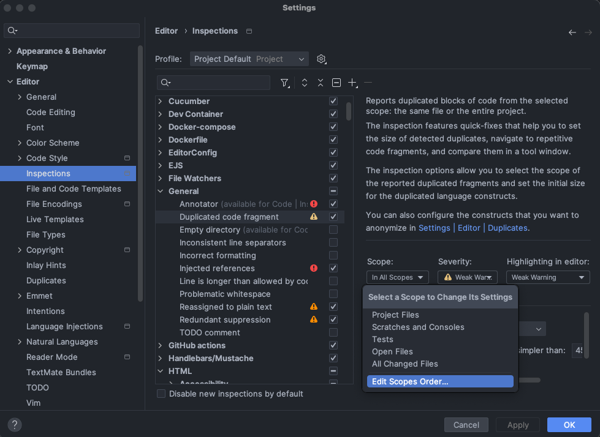
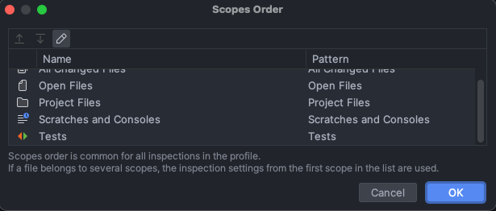
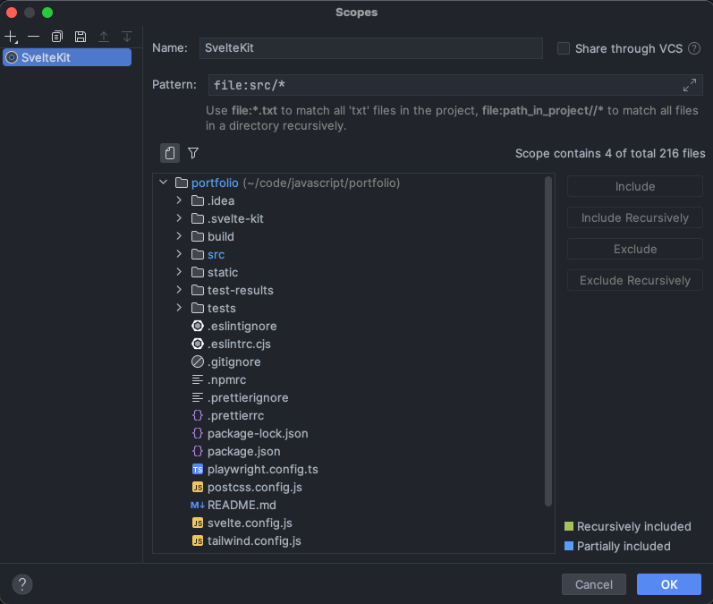
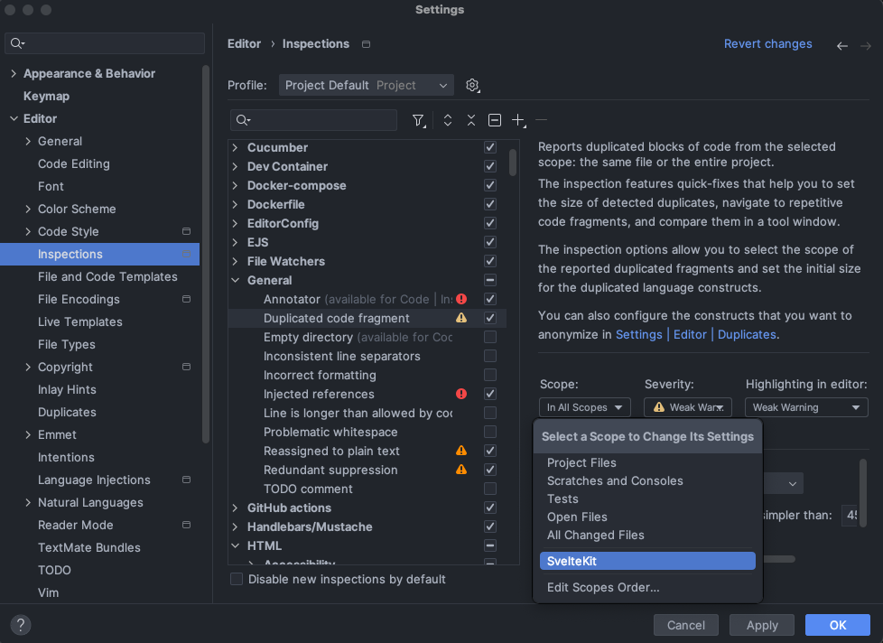

# WebStorm IDE 設定

目前寫 SvelteKit 是用 JetBrains 的 WebStorm 來進行開發。這裡記錄一些對於 WebStorm 的設定。

## 調整重複程式碼的偵測範圍

在寫 SvelteKit 中的 `+page.server.ts` 時，發現會莫名其妙的出現 _重複程式碼行數過多_ 的提醒。
看了一下才發現原來 WebStorm 也將 `.svelte-kit` 資料夾底下的檔案納入檢查的範圍。
但這個資料夾是 SvelteKit 自動產生的，照理說不應該納入檢查的範圍才對。

這個檢查的範圍可以進行調整。

首先在設定中找到 _Editor -> Inspections -> General -> Duplicate code fragment_。

點開 _Scope_ 下拉選單，並選擇 _Edit Scopes Order..._ 來新增自己想要的檢查範圍

點擊鉛筆圖示來新增檢查範圍。

新增一個叫做 `SvelteKit` 的範圍，並輸入 `file:src/*`。指定只檢查 `src` 資料夾底下的檔案。

在 _Scope_ 選擇剛剛建立的範圍 `SvelteKit`。並取消 `Everywhere else` 這個範圍。

## 參考資料

- [WebStorm Document - Locate duplicates](https://www.jetbrains.com/help/webstorm/analyzing-duplicates.html#configure-inspection)
